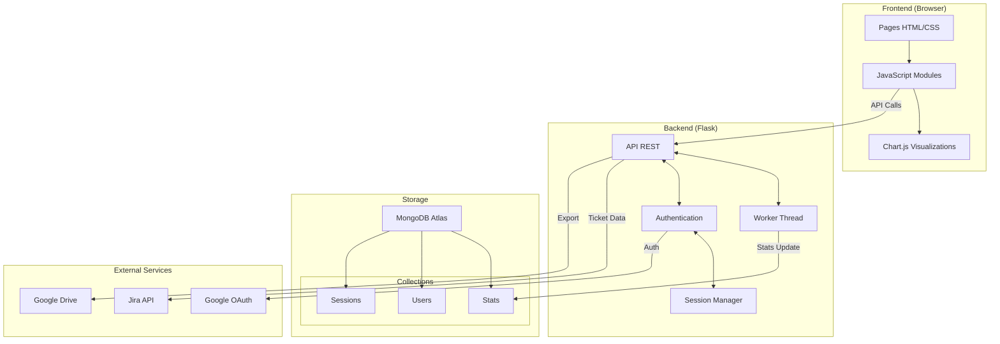
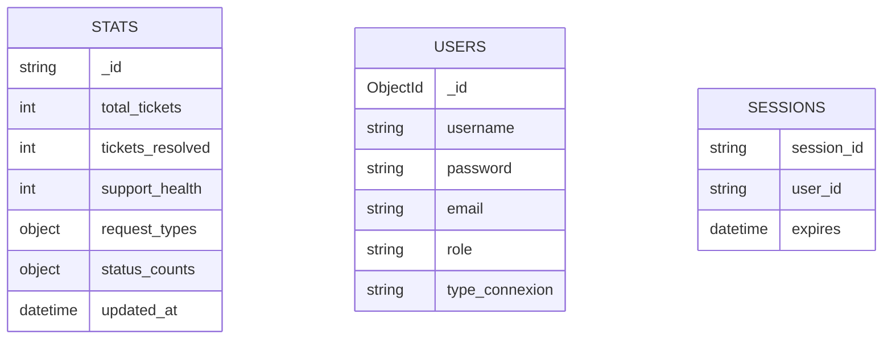

# Architecture du Dashboard Jira

Ce document détaille l'architecture technique du Dashboard Jira, une application web permettant de visualiser et gérer les tickets Jira ainsi que les utilisateurs.

## Vue d'ensemble



## Architecture Backend

### Composants Principaux

1. **API REST (Flask)**
   - Endpoints sécurisés avec authentification requise
   - Gestion des routes pour les statistiques, utilisateurs et rapports
   - Middleware CORS et gestion des sessions

2. **Worker Thread**
   - Mise à jour automatique des statistiques toutes les 5 minutes
   - Exécution asynchrone des requêtes Jira
   - Cache des données dans MongoDB

3. **Gestionnaire d'authentification**
   - Support multi-méthodes (local + Google SSO)
   - Hashage bcrypt des mots de passe
   - Migration automatique des anciens mots de passe

4. **Intégrations**
   - Client Jira (requêtes REST avec authentification)
   - Google OAuth2 pour SSO
   - Google Drive pour l'export des rapports

### Structure de la base de données



## Architecture Frontend

### Structure des modules

1. **Core Modules**
   - `dashboard.js`: Visualisation des KPIs et graphiques
   - `users.js`: Gestion des utilisateurs
   - `rapports.js`: Génération et export des rapports

2. **Composants UI**
   - Chart.js pour les visualisations
   - Interface responsive avec thème clair/sombre
   - Composants réutilisables (sidebar, overlay)

3. **Gestion des données**
   - Requêtes API avec gestion d'erreurs
   - Cache local des données
   - Rafraîchissement automatique (60s)

## Flux de données

1. **Statistiques Jira**
   ```mermaid
   sequenceDiagram
       Worker->>Jira: Fetch ticket data
       Jira-->>Worker: Raw ticket data
       Worker->>Worker: Process statistics
       Worker->>MongoDB: Store processed stats
       Frontend->>API: Request stats
       API->>MongoDB: Fetch cached stats
       MongoDB-->>API: Return stats
       API-->>Frontend: Send formatted stats
   ```

2. **Authentification**
   ```mermaid
   sequenceDiagram
       User->>Frontend: Login attempt
       Frontend->>API: Auth request
       alt Local Auth
           API->>MongoDB: Verify credentials
           MongoDB-->>API: User data
       else Google SSO
           API->>Google: OAuth2 flow
           Google-->>API: User info
           API->>MongoDB: Create/Update user
       end
       API-->>Frontend: Auth token + user data
   ```

## Sécurité

### Mesures implémentées

1. **Authentification**
   - Hashage bcrypt des mots de passe
   - Sessions MongoDB sécurisées
   - Support SSO Google avec OAuth2

2. **API Security**
   - Validation des ObjectId
   - Messages d'erreur neutres
   - Protection CORS configurable

3. **Data Security**
   - Pas d'exposition des mots de passe
   - Validation des entrées utilisateur
   - Tokens Jira et Google sécurisés

### Bonnes pratiques

- Variables d'environnement pour les secrets
- Rotation régulière des credentials
- Validation stricte des données entrantes
- Logs sécurisés sans données sensibles

## Déploiement

L'application utilise une architecture modulaire permettant un déploiement flexible :

- Backend Flask avec Waitress comme serveur WSGI
- MongoDB Atlas pour la scalabilité de la base de données
- Intégration continue possible avec les variables d'environnement
- Support du mode développement et production