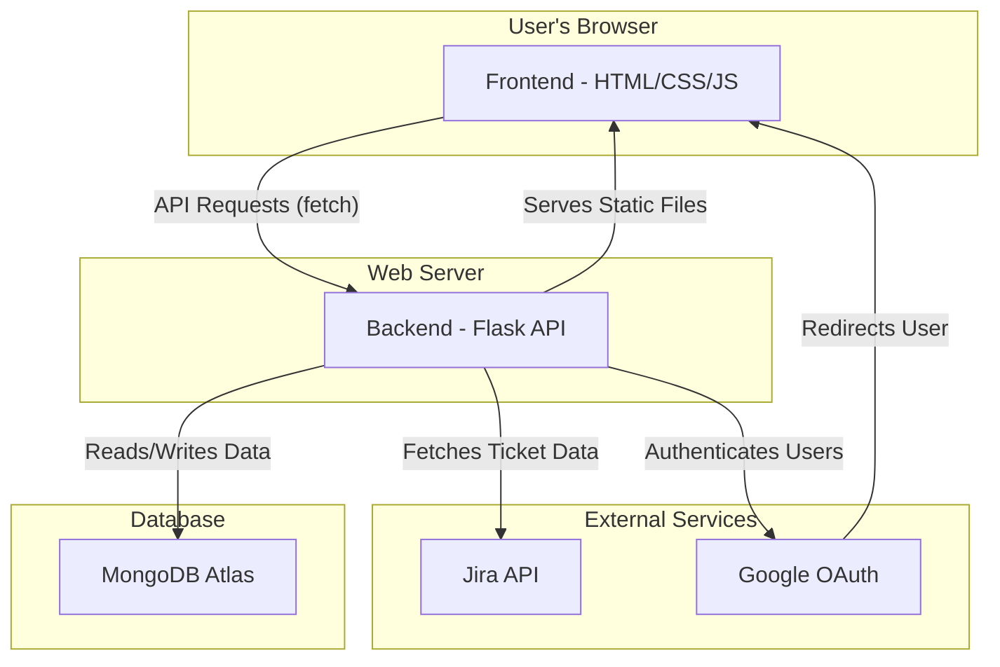

# Application Architecture

This document outlines the architecture of the Jira Dashboard application.

## Architecture Diagram

## Summary of the Architecture

*   The **Frontend** is a single-page application that communicates with the backend via API calls to fetch data and render it using Chart.js.
*   The **Backend** is a Flask application that exposes a REST API, connects to a MongoDB database, and integrates with the Jira API for data and Google for authentication.
*   **MongoDB** stores user information, session data, and cached statistics from Jira.
*   **Jira** is the source of truth for all ticket-related data.
*   **Google OAuth** provides a secure way for users to log in.